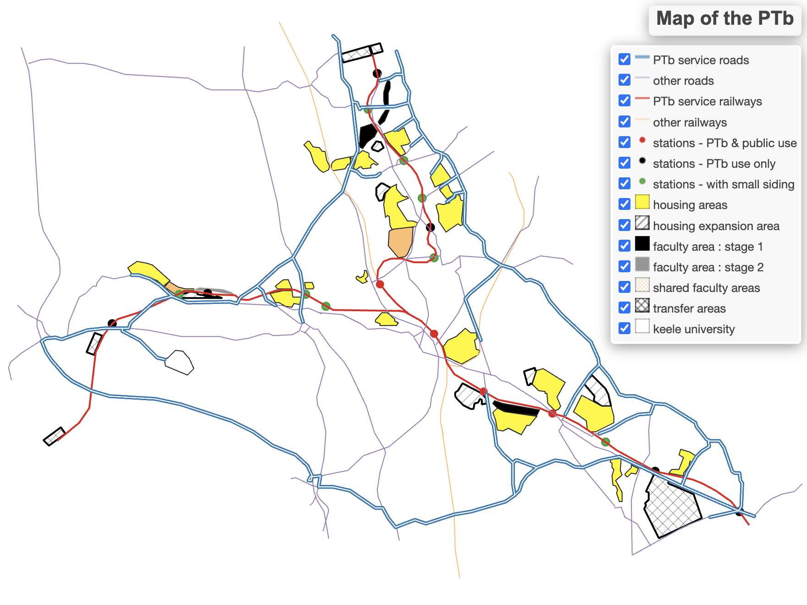

# Potteries Thinkbelt study: Further ongoing research

<table>
<tr>
<td width="50%" valign="top">

## Left Column

This is the left column content.

  
  
** • Map of the PTb showing main routes, transfer, faculty and housing areas—Reproduced from GitHub

[Learn More](https://archiblog.github.io/map-of-the-ptb/#12/53.0156/-2.1920)
</td>

<td width="50%" valign="top">

## Right Column

FOREWORD
On 16 June 2024 I wrote to the Canadian Centre for Architecture (CCA) asking:—

</td>
</tr>
</table>
